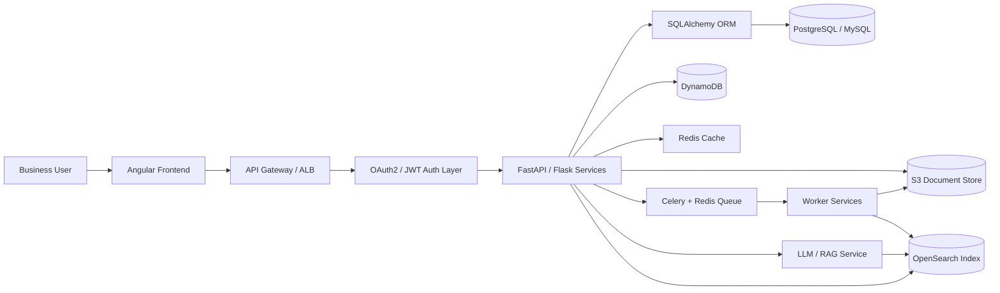
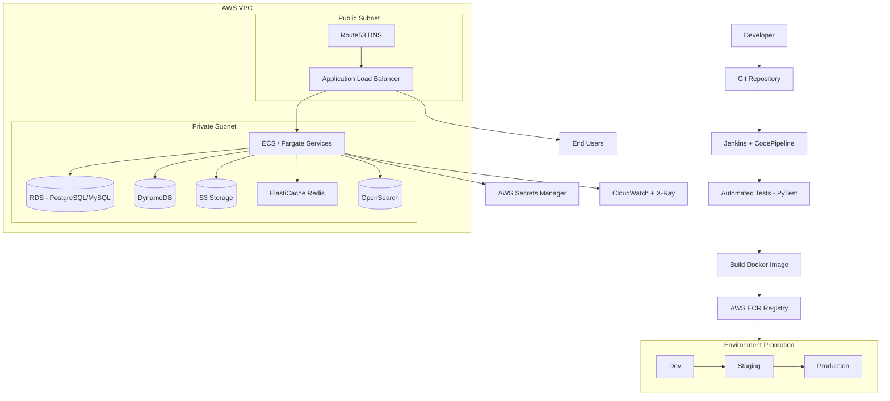

# AI-enabled Workflow and Document Intelligence Platform

## Architecture Diagram

## Deployment Diagram

## Server Build Path
- Build container images in CI with automated test gates.
- Push images to AWS ECR.
- Promote through Dev → Staging → Production environments.
- Deploy backend services to ECS/Fargate within a VPC (private subnets).
- Configure Route53 DNS to point to ALB (public subnet).
- Store secrets (DB credentials, API keys, JWT signing keys) in AWS Secrets Manager.
- Use ElastiCache Redis for caching and Celery task queues.
- Use CloudWatch/X-Ray for health monitoring, logging, and distributed tracing.
