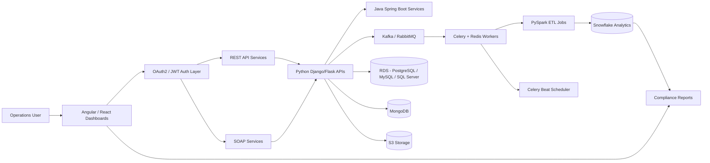
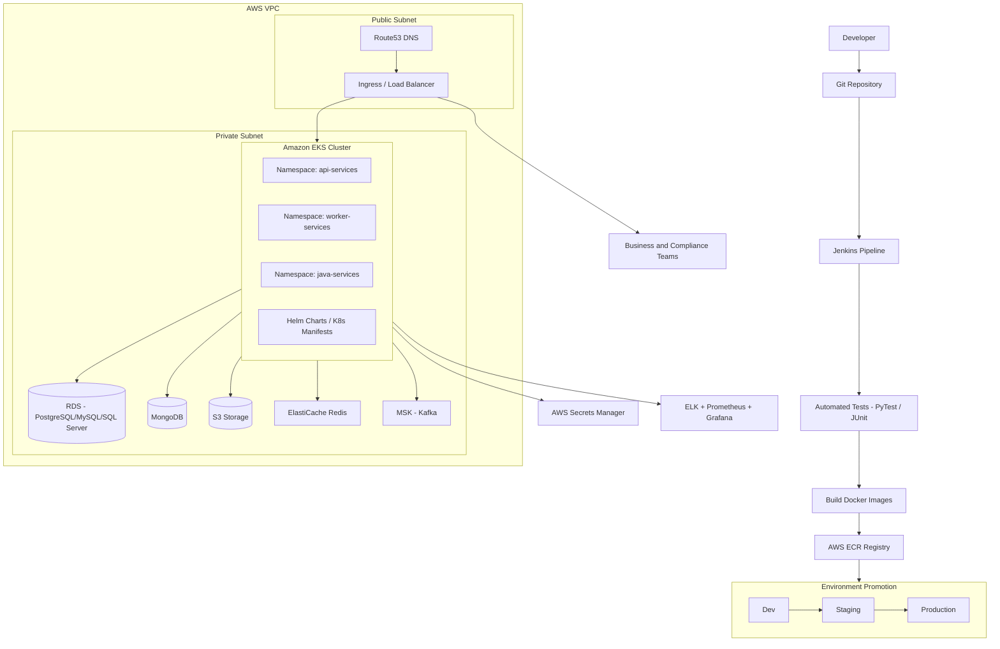

# Financial Transaction Processing and Compliance Analytics Platform

## Architecture Diagram

## Deployment Diagram

## Server Build Path
- Build and version Python and Java service containers in Jenkins with test gates (PyTest/JUnit).
- Push images to AWS ECR.
- Promote through Dev → Staging → Production environments.
- Deploy services to Amazon EKS using Helm charts with separated namespaces (api, workers, java).
- Configure MSK (Managed Kafka) and RabbitMQ for event-driven messaging.
- Use Celery Beat as scheduler for recurring reconciliation and compliance jobs.
- Store secrets (DB credentials, Kafka configs, API keys) in AWS Secrets Manager.
- Run PySpark ETL jobs to push data to Snowflake for compliance analytics.
- Route traffic through Route53 DNS → Ingress/Load Balancer → EKS pods.
- Monitor service health and alerts via ELK/Prometheus/Grafana.
