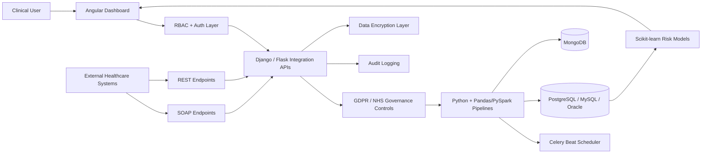
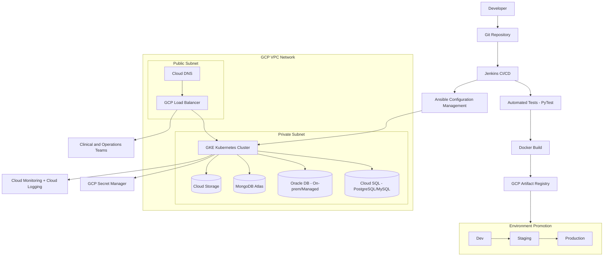

# Healthcare Interoperability and Patient Risk Analytics Platform

## Architecture Diagram

## Deployment Diagram

## Server Build Path
- Build API and worker containers through Jenkins with automated test gates.
- Push images to GCP Artifact Registry.
- Use Ansible for configuration management and infrastructure provisioning.
- Promote through Dev → Staging → Production environments.
- Deploy services to GKE Kubernetes cluster within GCP VPC (private subnets).
- Configure Cloud DNS to route traffic through GCP Load Balancer (public subnet).
- Store secrets (DB credentials, API keys, encryption keys) in GCP Secret Manager.
- Use Celery Beat to schedule recurring ETL and risk-scoring batch jobs.
- Enforce GDPR/NHS governance controls including data encryption, audit logging, and consent management.
- Expose both REST and SOAP endpoints for external healthcare system interoperability.
- Use Cloud Monitoring and Cloud Logging for production observability.
