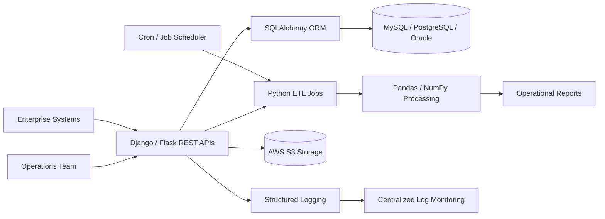
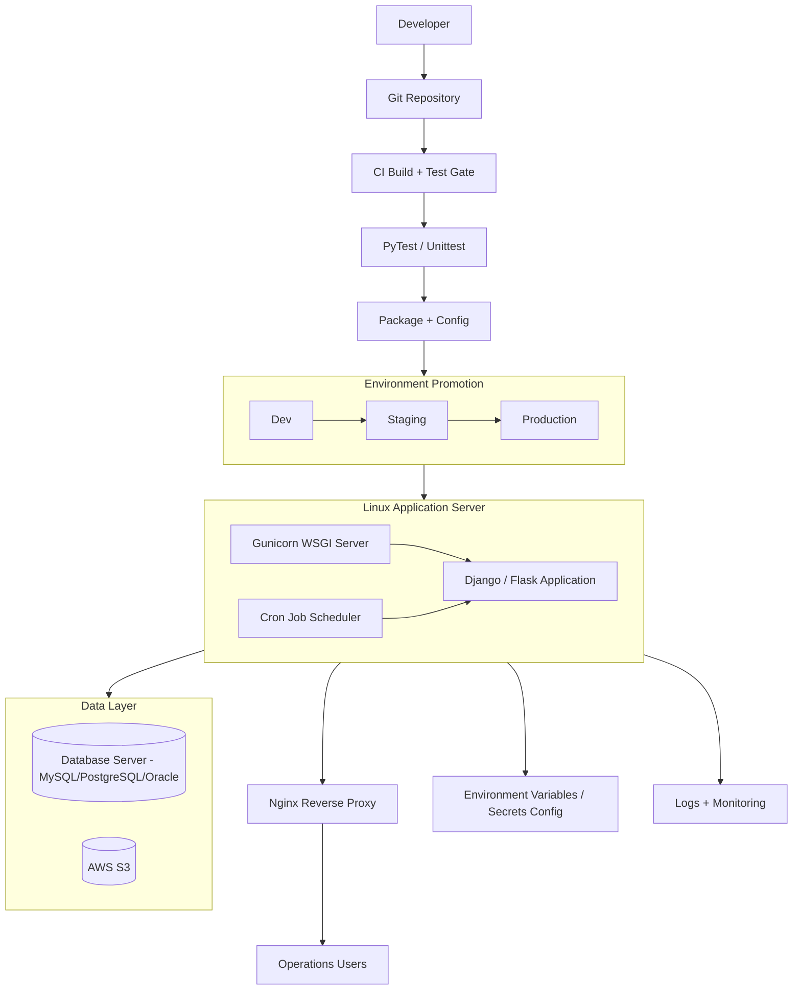

# Manufacturing Data Integration and Analytics Support Platform

## Architecture Diagram

## Deployment Diagram

## Server Build Path
- Run automated tests (PyTest/Unittest) as CI gate before packaging.
- Package Python services and configuration from CI.
- Promote through Dev → Staging → Production environments.
- Deploy to Linux application servers running Gunicorn as WSGI server.
- Configure Cron jobs for scheduled ETL and reporting tasks.
- Expose APIs through Nginx reverse proxy.
- Store DB credentials and API keys in environment variables / secrets config files.
- Use SQLAlchemy ORM for database interactions with MySQL/PostgreSQL/Oracle.
- Store required files/backups in AWS S3.
- Use structured logging with centralized log monitoring for production support.
